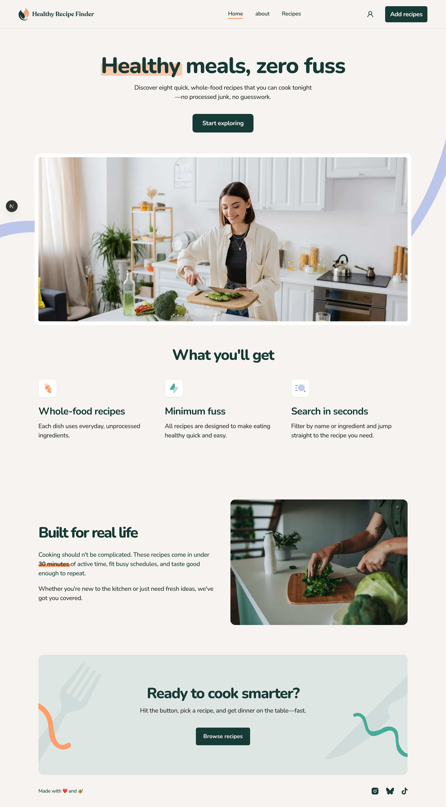
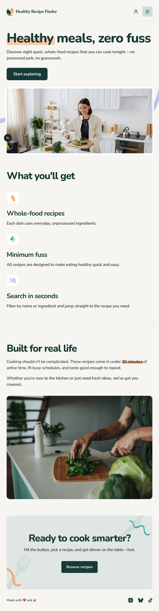
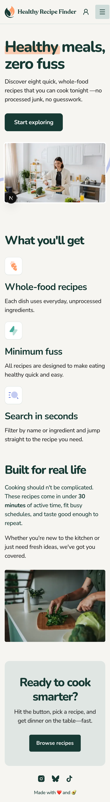

# Frontend Mentor - Recipe finder website solution

## Table of contents

- [Overview](#overview)
  - [The challenge](#the-challenge)
  - [Screenshot](#screenshot)
  - [Links](#links)
- [My process](#my-process)
  - [Built with](#built-with)
- [Author](#author)

## Overview

### The challenge

Users should be able to:

- View the home, about, recipes index, and recipe detail pages
- Search for recipes by name or ingredient
- Filter recipes by max prep or cook time
- View the optimal layout for the interface depending on their device's screen size
- See hover and focus states for all interactive elements on the page

### Screenshot

### Links

- Solution URL: [GitHub Repository](https://github.com/maziarja/healthyRecipeFinder)
- Live Site URL: [Deployed Site](https://healthy-recipe-finder-five.vercel.app)

## My process

### Built with

- Semantic HTML5 markup
- CSS custom properties
- [Tailwind CSS](https://tailwindcss.com/) - utility-first CSS framework
- [Shadcn UI](https://ui.shadcn.com/) - component library
- Flexbox
- CSS Grid
- Mobile-first workflow
- [Next.js](https://nextjs.org/) - React framework
- [MongoDB](https://www.mongodb.com/) & [Mongoose](https://mongoosejs.com/) - database and ODM
- [Auth.js](https://authjs.dev/) - authentication

## Author

- Frontend Mentor - [@maziarja](https://www.frontendmentor.io/profile/maziarja)
- X - [@maz_alem](https://x.com/maz_alem)
- LinkedIn - [@maziar-jamalialem](https://www.linkedin.com/in/maziar-jamalialem-677030345/)
- Instagram - [@mazja_dev](https://www.instagram.com/mazja_dev/)
